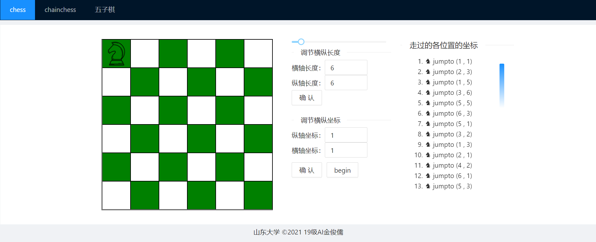
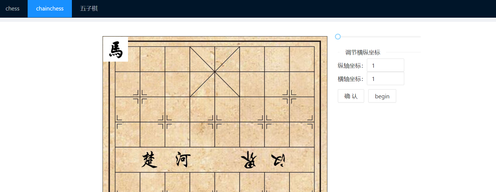

# Introduction

课设的一个简单介绍

## Question

设计程序完成如下要求：在中国象棋盘上，对任意位置上放置一个马，均能选择一个合适的路线，使得该棋子能够按照象棋的规则不重复的走过棋盘上的每一位置。

1. 依次输出走过的各位置的坐标
2. 最好能画出棋盘的图形形式，并在其上动态的标注行走过程
3. 程序能方便的移植到其他规格的棋盘上

## Answer

这道题目的原型是骑士巡游，在维基百科上可以很轻松的搜到关于这个题目的历史和方法

这里提供两个比较好的github的解答，这两个解答给了我很多思路和启发

[C#实现](https://github.com/anagardi/knight-tour)  [js实现](https://github.com/tiner101/Hours)

对这个题算法的想法

1. 用递归（迭代）来做这个题目，就是深度优先搜索，这是很容易就想到的方法
2. 但是如果仅仅只有迭代的话复杂度会很高，所以必须要有剪枝或者其他思路来辅助
3. 这里用到了一个很重要的规则：Warnsdorff规则指在所有可走且未经过的方格中，马只可能走这样一个方格：从该方格出发,马能跳的方格数最少；如果可跳的方格数相等，则从当前位置看,方格序号小的优先。依照这一规则往往可以找到一条路径但是并不一定能够成功。
4. 这个规则至关重要，通过这个规则对递归的顺序进行排序就能大量减少用时，这种方法可以归结为贪心的思想
5. 还有一个Tip，就是马的跳的顺序可以用两个数组组合来表示，这样会方便很多

对这个题图形化的想法

1. 图形化的话肯定是前端比较方便的实现，采用的是react，以及antd的ui
2. 用定时器来操作马的移动是动态显示的重点，以及数组的调整和映射也是尤其的重要

## How to run？

在clone后`npm install`再`npm start`即可

注意某些点可能还是跑不出来，会出现一定情况的程序崩溃

## Screen shots

